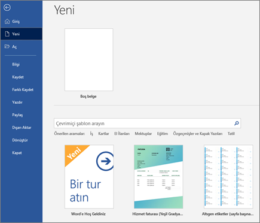
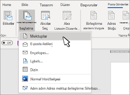
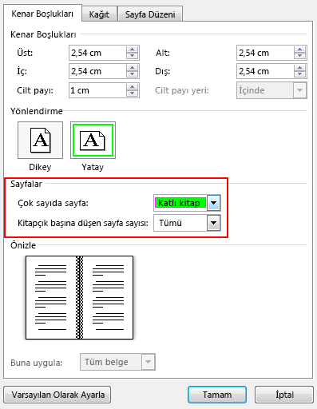
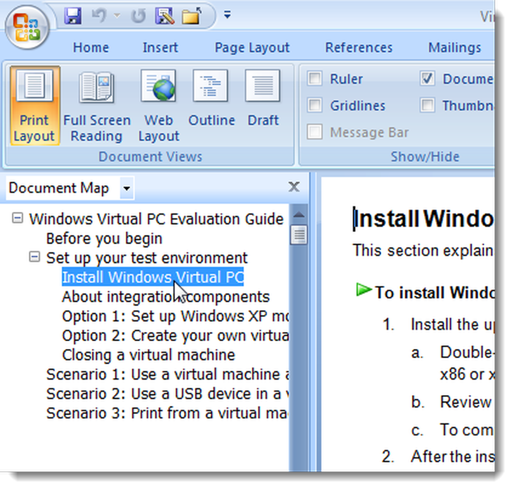

<!-- _backgroundColor: aquq -->

<!-- _color: GREEN -->

<!-- paginate: false -->

## MICROSOFT

### Hafta-2 (MICROSOFT WORLD)

#### Bahar Dönemi, 2022-2023

İndir [DOC](week-2.tr.md_doc.pdf), [SLIDE](week-2.tr.md_slide.pdf), [PPTX](week-2.tr.md_slide.pptx)

<iframe width=700, height=500 frameBorder=0 src="../week-2.tr.md_slide.html"></iframe>

---

<!-- paginate: true -->

### Anahat
-Word'de Giriş ve Belge Üzerinde Hareket Etme Yöntemleri
-Kelime Kısayollarıyla Çalışma
-Sayfa Düzeni ile Çalışma
-Tablolar Oluşturma
-İçerik Oluşturma

---

### Belge Açma

- **Belge Açma nedir?**
Belgeleri Word içindeki Aç iletişim kutusundan birçok farklı konumda açabilirsiniz. Bilgisayarınızın sabit sürücüsündeki veya bağlantınız olan bir ağ sürücüsündeki bir belgeyi açabilirsiniz. Ağınız UNC adreslerini desteklediği sürece, ağ sunucusuna bağlantınız olmasa bile ağda bir belge açabilirsiniz. ), World Wide Web'de HTTP bölgesine veya FTP bölgesine yerleştirilen belgeyi açabilirsiniz. Şirketinizin bir intraneti varsa, belgeleri orada açabilirsiniz.
---

### Belge Açma-1

- **Belge Açma nedir?**
Belgeleri Word içindeki Aç iletişim kutusundan birçok farklı konumda açabilirsiniz. Bilgisayarınızın sabit sürücüsündeki veya bağlantınız olan bir ağ sürücüsündeki bir belgeyi açabilirsiniz.

---

### Mektup Oluşturma-2

- **Mektup Oluşturma nedir?**
1 "Sevgili" veya "Kime" sözcükleri ile başlayan, ardından ad ve ardından iki nokta üst üste veya virgülle gelen, örneğin ¾ Sevgili Jane veya Tüm Kart Üyeleri: ¾ ve ardından ENTER'a basın.
2 Office Assistant'tan Mektup yazarken yardım al'ı tıklatın.
3 Harf Sihirbazı'ndaki yönergeleri izleyin. Bir adımı atlamak veya belirli bir panoya gitmek istiyorsanız, sekmelerden birine tıklayın. Bir seçenekte Yardım için soru işaretini ve ardından seçeneği tıklayın.

---

### Dahili Yazışma Oluşturma-3

- **Dahili Yazışma Oluşturma nedir?**
Dahili Yazışma Sihirbazı, hızlı bir şekilde dahili yazışmalar oluşturmanıza, dağılım listeleri oluşturmanıza, dahili iletişimlerinizi biçimlendirmenize ve başlıklar ile tarih, konu ve yazarın baş harfleri gibi sık kullanılan diğer öğeleri eklemenize yardımcı olur.
1 - Dosya menüsünde Yeni'ye tıklayın.
2 - Dahili Yazışmalar sekmesine tıklayın.
3 - Dahili Yazışma Sihirbazı'na çift tıklayın.
4 - Sihirbazdaki adımları izleyin.

---

### Belge Haritasını Kullanarak Gezinme-4

- **Belge Haritasını Kullanarak Gezinme nedir?**
Belge Haritası, belge başlıklarının ana hatlarını gösteren ayrı bir penceredir. Belgeler arasında kolayca gezinmek ve konumunuzu izlemek için Belge Haritası'nı kullanabilirsiniz. Örneğin, belgenin o kısmına atlamak için Belge Haritasındaki bir başlığa tıklayın. Word, Belge Haritasını çevrimiçi düzen görünümünde otomatik olarak görüntüler, ancak Belge Haritasını istediğiniz herhangi bir görünümde görüntüleyebilirsiniz.

1 - Belge Haritası'na tıklayın.
2 - Belge Haritası içinden gezinmek istediğiniz başlığa tıklayın.

Word, başlığı sayfanın en üstünde görüntüler. Başlık, belge içindeki konumunuzu göstermek için Belge Haritasında vurgulanır.

--- 

## Referanslar

- https://avesis.erdogan.edu.tr/ugur.coruh
- https://www.linkedin.com/in/ugurcoruh/
- https://www.hindawi.com/journals/scn/2018/6563089/ 
- https://dl.acm.org/doi/abs/10.1145/3410352.3410836
- https://www.sciencedirect.com/science/article/abs/pii/S2214212621002623 

---

$Hafta-2-Son$
